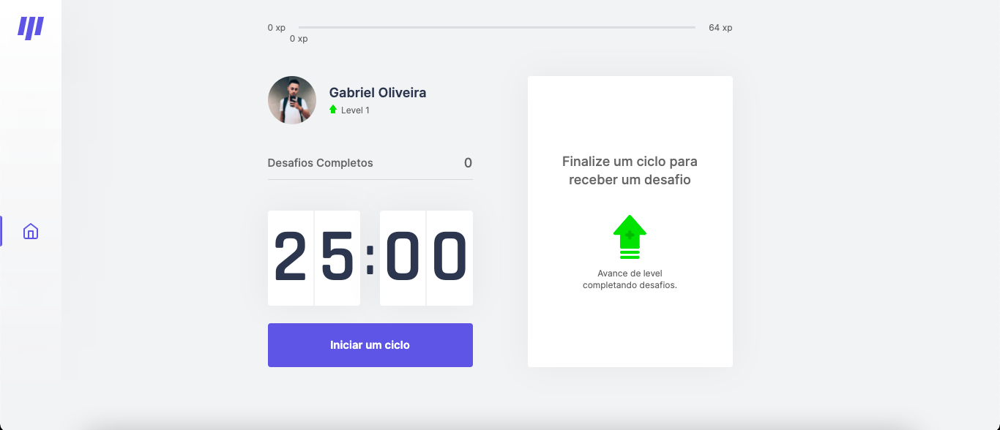

  

  <b>Pomodoro para devs.</b>

 

  
    

## Conteúdo

- [Sobre](#sobre)
- [Tecnologias](#tecnologias)
- [Pré-requisitos](#pre-requisitos)
- [Como usar](#como-usar)
- [Como contibuir](#como-contribuir)

## :bookmark: Sobre

O <strong>Move.It</strong> é uma aplicação Web que traz a técnica do Pomodoro com desafios para devs, integrado a um sistema de levels e xps. Aplicação feita com a tecnologia NextJs.

Essa aplicação foi construída na trilha <strong>React</strong> da <strong>Next Level Week 4.0</strong> distribuída pela [Rocketseat](https://rocketseat.com.br/).

## :rocket: Tecnologias Utilizadas

O projeto foi desenvolvido utilizando as seguintes tecnologias

- [NextJS](https://nextjs.org/)
- [ReactJS](https://reactjs.org/)
- [TypeScript](https://www.typescriptlang.org/)

## :fire: **Pré-requisitos**

- [Node.js](https://nodejs.org/en/)
- [NPM](https://www.npmjs.com/) ou [Yarn](https://yarnpkg.com/)

## :zap: Como usar

- Faça um clone desse repositório: `git clone https://github.com/Oliveiiraa/moveit.git`

- Entre na pasta: `cd moveit`

- Instale as dependências: `yarn install` ou `npm install`

- Rode o comando de inicialização: `yarn start` ou `npm start`

## :recycle: Como contribuir

- Faça um Fork desse repositório,
- Crie uma branch com a sua feature: `git checkout -b my-feature`
- Commit suas mudanças: `git commit -m 'feat: My new feature'`
- Push a sua branch: `git push origin my-feature`

## :mortar_board: Quem ministrou?

As aulas foram ministradas pelo mestre **[Diego Fernandes](https://github.com/diego3g)** nas aulas da **Next Level Week**.

---

<h4 align=center>Made with 💙 by <a href="https://www.linkedin.com/in/gabriel-h-oliveira/">Gabriel Oliveira</a></h4>